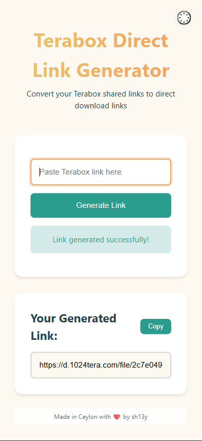

# 🚀 Terabox Direct Link Generator

> Because clicking through 15 ads to download a file should be optional


Convert those pesky Terabox shared links into direct download URLs faster than you can say "I didn't read the terms of service"!

## Features ✨

- **One-click Conversion** - Paste, click, boom! Direct link acquired
- **Dark Mode** - For those late-night link generating sessions
- **Mobile Friendly** - Works while you're pretending to work in the bathroom
- **Copy Button** - Because CTRL+C is too mainstream
- **Error Handling** - We tell you when things go wrong (which is never, right?)

## Preview 📸



> "It's not much, but it's honest work" - The App Probably

## Installation 🛠️

1. **Clone this repo** (or download it, we don't judge)
```bash
git clone https://github.com/sh13y/terabox-link-generator.git
```

2. **Install dependencies** (it's like grocery shopping but for code)
```bash
npm install
```

3. **Create `.env` file** (secrets go here)
```bash
echo "RAPIDAPI_KEY=your-api-key-here" > .env
echo "PORT=3006" >> .env
```

4. **Start the server** (choose your fighter)
```bash
npm run dev   # For development (with auto-restart)
npm start     # For production (serious business)
```

## Usage 🖱️

1. Visit `http://localhost:3006`
2. Paste your Terabox link
3. Click "Generate Link"
4. Profit 💰

## FAQ ❓

**Q: Is this legal?**  
A: We're developers, not lawyers. Use at your own risk.

**Q: Why does it need my API key?**  
A: To make you feel important. Also, actual technical reasons.

**Q: Can I use this while skydiving?**  
A: Only if you have good cell reception.

## Contributing 🤝

Found a bug? Want to add features? Great! Here's how:

1. Fork it (the repo, not your dinner)
2. Create your feature branch (`git checkout -b feature/amazing-feature`)
3. Commit your changes (`git commit -m 'Add some amazing feature'`)
4. Push to the branch (`git push origin feature/amazing-feature`)
5. Open a Pull Request (and pray to the merge gods)

## License 📜

**WTFPL (Do What The F*ck You Want To Public License)**

```
            DO WHAT THE FUCK YOU WANT TO PUBLIC LICENSE
                    Version 2, December 2004

 Copyright (C) 2004 Sam Hocevar <sam@hocevar.net>

 Everyone is permitted to copy and distribute verbatim or modified
 copies of this license document, and changing it is allowed as long
 as the name is changed.

            DO WHAT THE FUCK YOU WANT TO PUBLIC LICENSE
   TERMS AND CONDITIONS FOR COPYING, DISTRIBUTION AND MODIFICATION

  0. You just DO WHAT THE FUCK YOU WANT TO.
```

## Support ☕

If this saved you time, consider:
- [Buy me a coffee](https://www.buymeacoffee.com/sh13y)
- Starring the repo ⭐
- Telling your cat about it 🐈

---

Made with ❤️ (and occasional profanity) in Ceylon by [sh13y](https://github.com/sh13y)